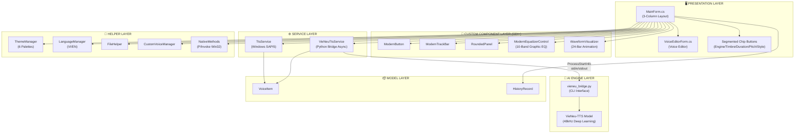
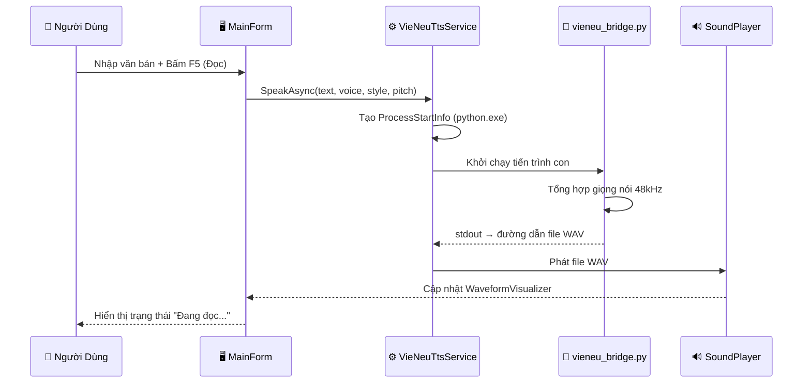
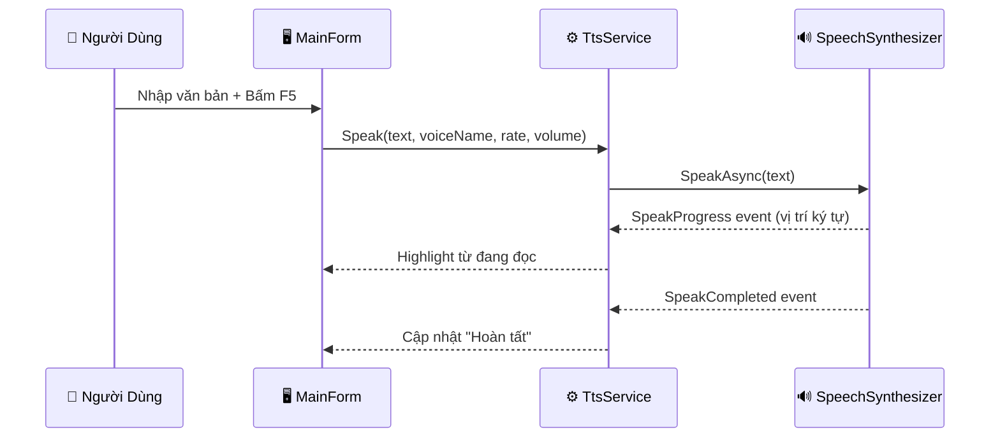

# 🏗️ KIẾN TRÚC PHẦN MỀM VOICECRAFT STUDIO PRO

> Tài liệu kỹ thuật chi tiết mô tả kiến trúc, luồng xử lý và các design pattern trong phần mềm.

---

## 1. SƠ ĐỒ KHỐI TỔNG QUAN HỆ THỐNG



---

## 2. PHÂN TẦNG KIẾN TRÚC (SOLID PRINCIPLES)

### 2.1. Presentation Layer — Giao Diện Người Dùng
| Thành phần | File | Vai trò |
|-----------|------|---------|
| `MainForm` | `MainForm.cs` + `.Designer.cs` | Form chính 3 cột, borderless, custom title bar |
| `VoiceEditorForm` | `Forms/VoiceEditorForm.cs` | Form phụ chỉnh sửa giọng đọc |
| Chip Buttons | Trong `MainForm.Designer.cs` | 5 nhóm nút bấm phân đoạn WinUI 3 |

- **Layout 3 cột**: Left Sidebar (500px, Dock Left) → Center Editor (Fill) → Right History (241px, Dock Right)
- **Header**: Custom borderless 115px, kéo di chuyển qua P/Invoke `SendMessage` + `ReleaseCapture`
- **Menu**: MenuStrip (Tệp/Chỉnh Sửa/Giọng Đọc/Trợ Giúp) + ToolStrip (Mở/Xuất/Đọc/Dừng)

### 2.2. Custom Component Layer — Linh Kiện Tự Vẽ GDI+
| Control | Kế thừa | Dòng code | Chức năng |
|---------|---------|-----------|-----------|
| `ModernButton` | `Button` | 161 | Nút bấm bo góc, 3 trạng thái (Normal/Hover/Click) |
| `ModernEqualizerControl` | `UserControl` | 127 | 10-band EQ (31Hz-16kHz), cần gạt ±12dB |
| `ModernTrackBar` | `Control` | 233 | Thanh trượt, progress fill, thumb zoom on hover |
| `RoundedPanel` | `Panel` | 124 | Panel bo góc, gradient fill, border tùy chỉnh |
| `WaveformVisualizer` | `Control` | 112 | Phổ sóng âm 24 thanh, animation 20 FPS |

Tất cả sử dụng `System.Drawing.Drawing2D`, category `"Cinematic UI"`, và `DoubleBuffered = true`.

### 2.3. Service Layer — Dịch Vụ Đọc Văn Bản
| Service | Engine | Chất lượng | Phương thức chính |
|---------|--------|-----------|-------------------|
| `TtsService` | Windows SAPI5 | Phụ thuộc voice cài đặt | `Speak()`, `ExportToWavAsync()` |
| `VieNeuTtsService` | VieNeu Deep Learning | 48kHz/16-bit WAV | `SpeakAsync()`, `GenerateAudioWavAsync()` |

### 2.4. Helper Layer — Tiện Ích Hỗ Trợ
- **ThemeManager**: Singleton quản lý 6 bảng màu `ThemePalette`, áp dụng đồng bộ lên toàn bộ controls
- **LanguageManager**: Chuyển đổi ngôn ngữ VI/EN cho tất cả nhãn giao diện
- **NativeMethods**: P/Invoke `SendMessage(WM_NCLBUTTONDOWN)` + `ReleaseCapture()` cho kéo Form borderless

### 2.5. Model Layer — Mô Hình Dữ Liệu
- **VoiceItem**: `Id`, `Name`, `Culture`, `Gender` — đại diện cho 1 giọng đọc
- **HistoryRecord**: `Id (Guid)`, `Text`, `VoiceName`, `Timestamp`, `CharCount` — lưu lịch sử đọc

---

## 3. LUỒNG XỬ LÝ DỮ LIỆU

### 3.1. Luồng đọc văn bản VieNeu AI


### 3.2. Luồng đọc văn bản Windows SAPI5


---

## 4. MÔ HÌNH GIAO TIẾP C# ↔ PYTHON

```
┌─────────────────────┐          ┌─────────────────────────┐
│   C# WinForms App   │          │   Python VieNeu-TTS      │
│                     │          │                         │
│  VieNeuTtsService   │──stdin──▶│  vieneu_bridge.py       │
│  (ProcessStartInfo) │◀─stdout──│  (CLI --text --voice    │
│                     │◀─stderr──│   --style --pitch       │
│  - RedirectStdOut   │          │   --output)             │
│  - RedirectStdErr   │          │                         │
│  - UseShellExecute  │          │  Xuất file WAV 48kHz    │
│    = false          │          │                         │
└─────────────────────┘          └─────────────────────────┘
```

**Tham số CLI của `vieneu_bridge.py`:**
- `--list-voices` — Liệt kê 14 giọng đọc có sẵn
- `--text "Nội dung"` — Văn bản cần đọc
- `--voice "tên_giọng"` — Giọng đọc sử dụng
- `--style "phong_cách"` — natural / news / story / drama
- `--pitch 0.0` — Dịch chuyển cao độ (semitones)
- `--output "path.wav"` — Đường dẫn xuất file WAV

---

## 5. DESIGN PATTERNS SỬ DỤNG

| Pattern | Vị trí áp dụng | Mô tả |
|---------|----------------|-------|
| **Observer** | `TtsService.SpeakProgress`, `GainChanged` | Event-driven cập nhật UI |
| **Strategy** | Dual Engine (SAPI5 / VieNeu) | Chọn engine đọc tại runtime |
| **Singleton** | `ThemeManager`, `LanguageManager` | Quản lý trạng thái toàn cục |
| **Bridge** | `VieNeuTtsService` ↔ Python | Cầu nối C# → Python subprocess |
| **Composite** | `RoundedPanel` chứa controls con | Panel lồng nhau tạo layout phức tạp |

---

## 6. CẤU TRÚC THƯ MỤC

```
BT_TNC_Dot-NET/
├── Controls/                    # Custom Controls GDI+
│   ├── ModernButton.cs          # Nút bấm bo góc
│   ├── ModernEqualizerControl.cs# 10-Band Graphic EQ
│   ├── ModernTrackBar.cs        # Thanh trượt tùy chỉnh
│   ├── RoundedPanel.cs          # Panel bo góc gradient
│   └── WaveformVisualizer.cs    # Phổ sóng âm animation
├── Forms/                       # Forms phụ
│   ├── VoiceEditorForm.cs       # Form chỉnh sửa giọng
│   └── VoiceEditorForm.Designer.cs
├── Helpers/                     # Tiện ích hỗ trợ
│   ├── CustomVoiceManager.cs    # Quản lý giọng tùy chỉnh
│   ├── FileHelper.cs            # Đọc/ghi file văn bản
│   ├── LanguageManager.cs       # Đa ngôn ngữ VI/EN
│   ├── NativeMethods.cs         # P/Invoke Win32 API
│   └── ThemeManager.cs          # 6 bảng màu theme
├── Models/                      # Mô hình dữ liệu
│   └── VoiceItem.cs             # VoiceItem + HistoryRecord
├── Services/                    # Dịch vụ TTS
│   ├── TtsService.cs            # Windows SAPI5
│   └── VieNeuTtsService.cs      # VieNeu AI 48kHz
├── Properties/                  # Assembly metadata
├── VieNeu-TTS/                  # Python AI Engine (submodule)
├── doc/                         # Tài liệu kỹ thuật
├── MainForm.cs                  # Form chính (692 dòng)
├── MainForm.Designer.cs         # Layout Designer (2,154 dòng)
├── MainForm.resx                # Resources
├── Program.cs                   # Entry point
├── App.config                   # Cấu hình ứng dụng
└── BT_TNC_Dot-NET.csproj       # Project file (.NET 4.8)
```
